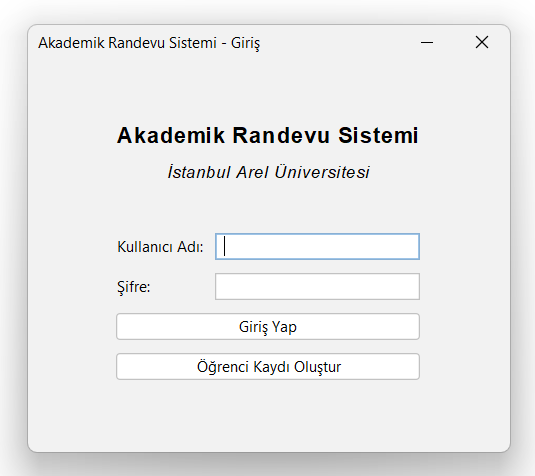
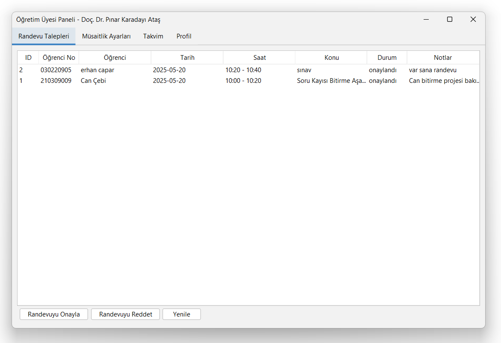
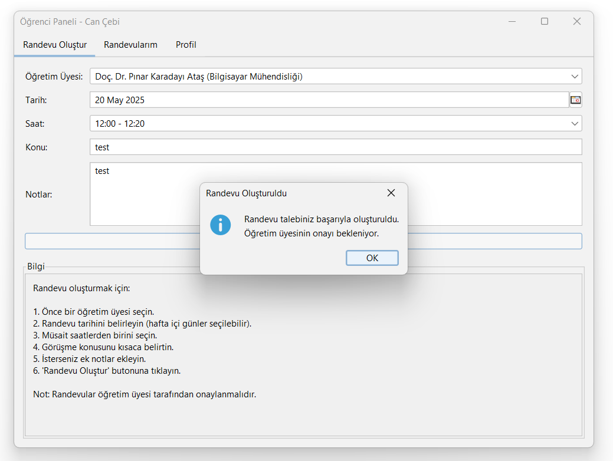

# Academic Appointment System

A Java Swing desktop application for appointment management between students and faculty members at Istanbul Arel University.

## Project Description

This application facilitates the easy creation and management of appointments between students and faculty members in a university environment. Faculty members set their available hours, students request appointments, and faculty members approve or reject these requests.

## Screenshots

### Login Screen


### Faculty Panel


### Student Panel


## Features

- **Multiple User Types**: Student, faculty member, and administrator roles
- **Appointment Management**: Creation, approval, rejection, and cancellation
- **Availability Calendar**: Faculty members can set their available times
- **Calendar View**: View daily appointments
- **Secure Authentication**: BCrypt encryption

## Installation Requirements

- JDK 11 or higher
- PostgreSQL 12 or higher
- Maven (optional, for building)
- NetBeans, Eclipse, or IntelliJ IDEA IDE (for development)

## Database Setup

1. Create a PostgreSQL database
2. Run the `randevu_db.sh` script or manually execute the SQL commands
3. Update the connection information in the `VeritabaniYoneticisi.java` file:

```java
private static final String URL = "jdbc:postgresql://localhost:5432/randevu_db";
private static final String KULLANICI = "username";
private static final String SIFRE = "password";
```

## Build and Run

```bash
# Clone the repository
git clone https://github.com/username/academic-appointment-system.git

# Navigate to the project directory
cd academic-appointment-system

# Build the JAR file (with Maven)
mvn clean package

# Run the application
java -jar target/randevu-sistemi.jar
```

## Creating an Administrator User

For first-time use, you need to create an administrator user. Follow these steps to create a BCrypt hash of your password and add an admin user:

1. Download the jBCrypt library:
```bash
wget https://repo1.maven.org/maven2/org/mindrot/jbcrypt/0.4/jbcrypt-0.4.jar
```

2. Either use the library directly to hash a password:
```bash
java -cp jbcrypt-0.4.jar org.mindrot.jbcrypt.BCrypt 'adminpassword'
```

   Or create a simple Java file (HashPassword.java) to generate the hash:
```java
import org.mindrot.jbcrypt.BCrypt;

public class HashPassword {
    public static void main(String[] args) {
        String password = "adminpassword"; // Your desired password
        String hashed = BCrypt.hashpw(password, BCrypt.gensalt());
        System.out.println("Hashed password: " + hashed);
    }
}
```

   And compile/run it:
```bash
javac -cp .:jbcrypt-0.4.jar HashPassword.java
java -cp .:jbcrypt-0.4.jar HashPassword
```

3. Edit the `admin_olustur.sh` script and update the password hash:
```bash
#!/bin/bash
# Administrator user creation script
# Generate the hash of the password (BCrypt format)
# You need to download jBCrypt library first:
# wget https://repo1.maven.org/maven2/org/mindrot/jbcrypt/0.4/jbcrypt-0.4.jar
# java -cp jbcrypt-0.4.jar org.mindrot.jbcrypt.BCrypt 'adminpassword'

# Password hash
HASH='your_generated_hash_here'

# Add the administrator user to the database
sudo -u postgres psql -d randevu_db << EOF
INSERT INTO kullanicilar (kullanici_adi, email, sifre_hash, ad, soyad, kullanici_tipi)
VALUES ('adminusername', 'admin@example.com', '$HASH', 'Admin', 'User', 'yetkili')
ON CONFLICT (kullanici_adi) DO UPDATE
SET email = 'admin@example.com',
    sifre_hash = '$HASH',
    ad = 'Admin',
    soyad = 'User';
EOF
echo "Administrator user has been successfully created/updated."
```

4. Run the script:
```bash
chmod +x admin_olustur.sh
./admin_olustur.sh
```

5. You can now log in with the username "adminusername" and your chosen password.

## License

This project is licensed under the [MIT License](LICENSE).